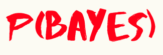

The purpose of this repository is my self practice of Naive Bayes theorem. Exercise from the Book "Data Science from Scratch"

I am a student that is learning, let me know if you find any errors,the code is inspired from examples and exercises found in books.

## A few important things that I learned

*  This model is part of a family of simple "probabilistic classifiers" based on applying Bayes' theorem

* We are  making the assumption that the presences of each word are independent one another

### todo
- [ ] Add info about what I learned
- [ ] add a use case for the model

## Resources that I used to learn about this fun topic:
* Book: Data Science from Scratch, Joel Grus
* Video: Bayes theorem, Khan Academy 
